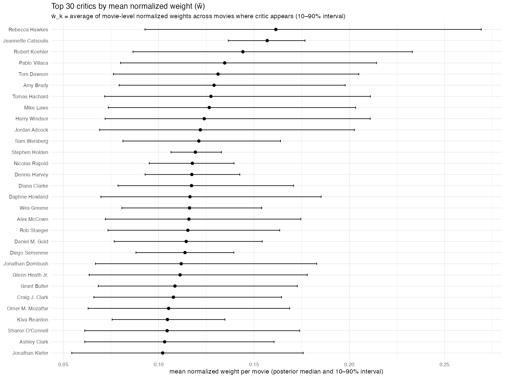
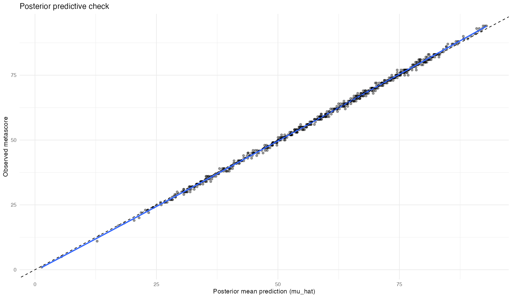
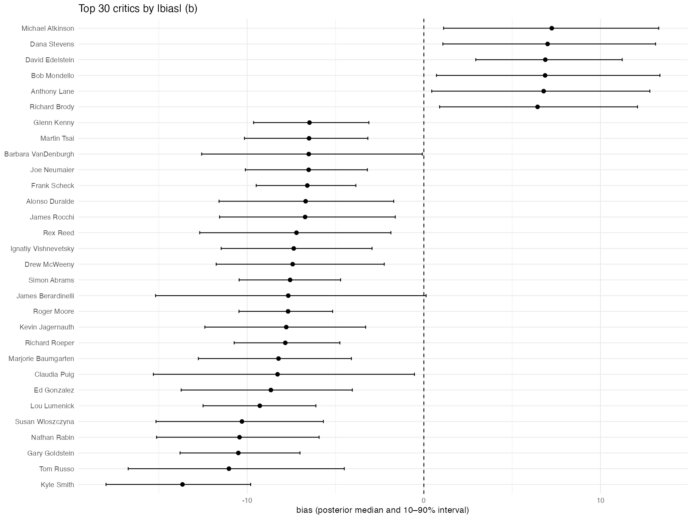
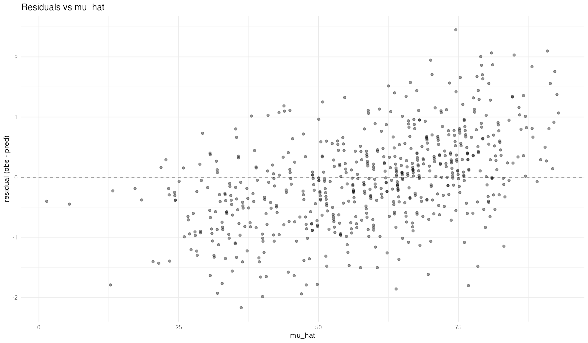
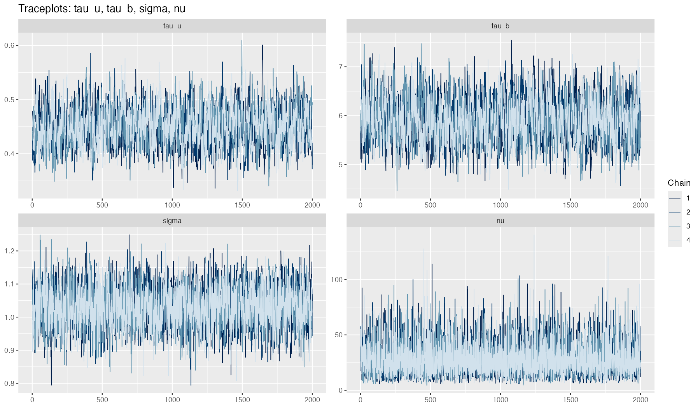

# Bayesian Estimation of Critic Influence in Metacritic Scores

## Overview

This project implements a **Bayesian hierarchical model** to estimate **latent critic influence weights** and **systematic critic bias** behind Metacritic movie scores.

Metacritic does not publicly disclose how individual critic reviews are aggregated into a final metascore.  
The goal of this project is **not to reverse-engineer Metacritic exactly**, but to infer **plausible relative influence weights** of critics based solely on observed critic scores and final metascores.

The core question is:

> *Given a set of critic reviews for each movie and the resulting metascore, what can we infer about how much each critic tends to influence the final score?*

---

## Modeling Philosophy

The model assumes that:

- Each critic has a **global influence parameter** that applies consistently across all movies they review.
- Only critics who reviewed a given movie contribute to its metascore.
- Critic influence is **relative within each movie**, i.e. weights are normalized over the subset of critics present for that movie.
- Critics may exhibit **systematic bias** (tendency to score higher or lower than average).

This results in a **subset-normalized weighted average model** with explicit uncertainty quantification.

---

## Mathematical Model

For each movie $j$, let $C_j$ be the set of critics who reviewed that movie.

### Latent critic parameters

Each critic $k$ has two global (movie-independent) latent parameters:

- Log-weight: $u_k \in \mathbb{R}$
- Bias: $b_k \in \mathbb{R}$ (in metascore points)

To ensure identifiability, both parameters are centered:

$$
u_k \leftarrow u_k - \frac{1}{K}\sum_{k=1}^{K} u_k
$$

$$
b_k \leftarrow b_k - \frac{1}{K}\sum_{k=1}^{K} b_k
$$

### Movie-level normalized weights (subset softmax)

Log-weights are exponentiated to obtain positive unnormalized weights:

$$
\alpha_k = \exp(u_k)
$$

For a given movie $j$, weights are normalized **only over critics who appear in that movie**:

$$
w_{jk} = \frac{\alpha_k}{\sum_{k' \in C_j} \alpha_{k'}}
$$

This guarantees:

- $w_{jk} > 0$
- $\sum_{k \in C_j} w_{jk} = 1$ (for each movie)
- Automatic rescaling when critics are missing

### Expected metascore

Let $s_{jk}$ be critic $k$’s observed score for movie $j$ (0–100).
The expected metascore is a weighted average of bias-adjusted critic scores:

$$
\mu_j = \sum_{k \in C_j} w_{jk} \, (s_{jk} + b_k)
$$

### Likelihood

Observed metascores are modeled using a robust Student-t likelihood:

$$
\text{metascore}_j \sim \text{StudentT}(\nu, \mu_j, \sigma)
$$

where:

- $\sigma$ is residual noise on the 0–100 scale
- $\nu$ controls tail heaviness (robustness to outliers)

---

## Inference and Computation

- Implemented in **Stan** via **cmdstanr**
- Sampler: **NUTS (No-U-Turn Sampler)** with adaptive step size
- Multiple chains with convergence diagnostics:
  - R-hat
  - Effective Sample Size
  - E-BFMI
  - Divergence checks
- Defensive runtime checks prevent silent NaN / Inf propagation

Posterior summaries include:
- Critic influence weights with uncertainty
- Critic bias distributions
- Posterior predictive checks
- Residual diagnostics
- Influence uncertainty vs. number of reviews

---

## Key Outputs

- **Relative critic influence** (mean normalized weight per movie)
- **Critic bias estimates** (positive or negative scoring tendencies)
- **Uncertainty diagnostics** (credible intervals, review count effects)
- **Posterior predictive validation plots**

These results allow ranking critics by:
- Expected influence
- Bias magnitude
- Certainty of estimation

## Critic influence weights

The figure below shows the **posterior mean normalized critic weights**
(averaged across movies where the critic appears).

  

Higher values mean a critic tends to receive more relative weight within movies they review; overlapping intervals imply the data cannot reliably distinguish their influence.

## Posterior Predictive Check

  

This plot compares the model’s posterior mean predictions ($\mu_{hat}$) to the observed Metascore values.

- Gray points: individual movies (predicted vs. observed score).

- Dashed line: identity line $𝑦=𝑥$ (perfect agreement)

- Blue line: LOESS (LOcal regrESSion) highlighting systematic trends.

Interpretation:
Points closely follow the identity line and the smooth shows no systematic deviation, indicating that the inferred critic weights and biases reproduce the observed Metascore as intended.

Note:
This check validates model consistency and numerical correctness. It does not demonstrate out-of-sample predictive performance or prove uniqueness of the inferred weights.

## Critic bias estimates

  

Positive values indicate a tendency to score above the consensus, negative values below it; wide intervals reflect limited information rather than extreme bias.

## Residual diagnostics

  

This residual plot shows that prediction errors are roughly centered around zero with increasing spread at higher metascores, indicating heteroskedasticity not explicitly modeled, but no strong systematic bias in the mean prediction.

## Trace plots

  

The trace plots show good mixing and stationarity across all chains for the main parameters, indicating stable sampling and no obvious convergence issues.

---

## What This Project Is *Not*

This project is **explicitly not** intended to:

- Reproduce Metacritic’s true proprietary algorithm
- Predict future metascores accurately
- Perform recommendation or sentiment analysis
- Serve as a production scoring system
- Claim causal influence of critics on audience perception

The model is **inferential**, not predictive, and should be interpreted accordingly.

---

## Reproducibility Notes

- Results depend on available critic coverage and review frequency
- Critics with few reviews naturally exhibit higher uncertainty
- All assumptions are explicit and inspectable in the Stan model

---

## License

This repository is intended for **educational and analytical purposes**.  
No affiliation with or endorsement by Metacritic.

